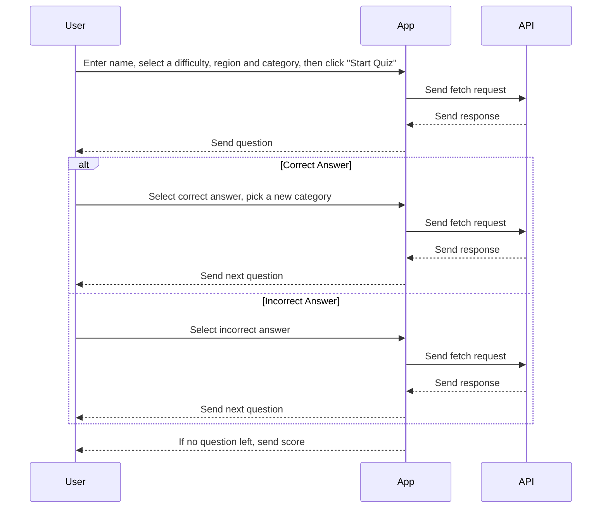

# UML Sequence Diagram

```mermaid
sequenceDiagram
    participant  U as User
    participant A as App
    participant T as API

    U->>A: Enter name, select a difficulty, region and category, then click "Start Quiz"

    A->>T: Send fetch request
    T-->>A: Send response
    A-->>U: Send question

    alt Correct Answer
        U->>A: Select correct answer, pick a new category
        A->>T: Send fetch request
        T-->>A: Send response
        A-->>U: Send next question

    else Incorrect Answer
        U->>A: Select incorrect answer
        A->>T: Send fetch request
        T-->>A: Send response
        A-->>U: Send next question

    end

        A-->>U: If no question left, send score
```
